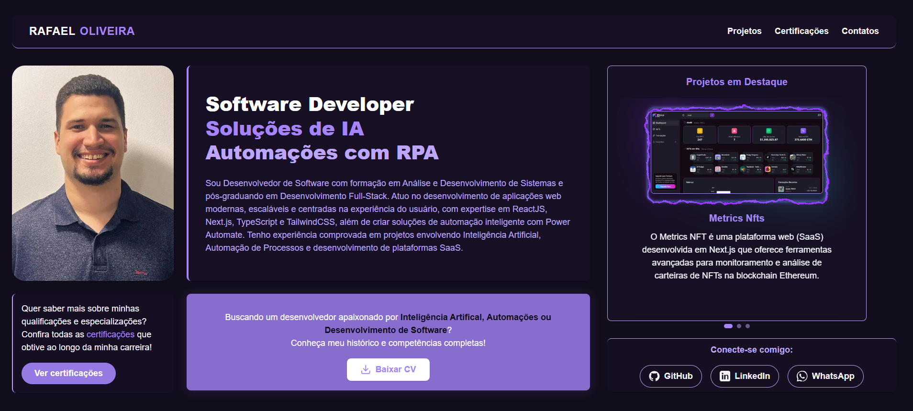

**Portfolio Rafael Oliveira!**
Este é o meu portfólio pessoal, cuidadosamente desenvolvido para apresentar minha jornada profissional, os projetos mais impactantes que construí, meu currículo detalhado e todos os certificados que atestam minhas habilidades. Tudo isso de uma forma moderna, fluida e visualmente cativante.

**Tecnologias e Stack Principal**
Este portfólio foi construído com as seguintes tecnologias de ponta, garantindo performance e uma experiência de usuário excepcional:

- **Next.js 14+**: Framework React para renderização otimizada e performance.
- **React**: Biblioteca JavaScript para construção de interfaces de usuário dinâmicas.
- **TailwindCSS**: Framework CSS utilitário para um design rápido e responsivo.
- **Prisma ORM**: ORM moderno para interagir com o banco de dados de forma segura e eficiente.
- **Neon DB (PostgreSQL Cloud)**: Banco de dados PostgreSQL escalável e performático na nuvem.
- **Inspiração em Bento Grid**: Layout moderno e modular para uma apresentação visual única.
  **Funcionalidades em Destaque**
  Explore as principais seções e recursos que você encontrará neste portfólio:

**Página Inicial (Home)**: Uma introdução à minha trajetória, com minhas experiências mais recentes e um panorama das minhas habilidades.

**Seção de Projetos:** Mergulhe nos meus projetos mais relevantes, com descrições detalhadas, tecnologias utilizadas e links para demonstrações ou repositórios.

**Currículo para Download:** Acesse e baixe meu currículo profissional em formato PDF para uma visão completa da minha experiência.
Galeria de Certificados: Visualize meus certificados e reconhecimentos, comprovando minhas qualificações e aprendizado contínuo.

**Formulário de Contato Integrado:** Entre em contato comigo facilmente através de um formulário robusto, diretamente conectado ao banco de dados (NeonDB + Prisma).

**Design Moderno e Intuitivo:** Desfrute de uma experiência de navegação agradável, com um design limpo, suporte a Dark Mode e responsividade total.

**Imagem do projeto**:

Pronto para explorar?

Visite o Site: https://portfolio-rafael-oliveira.vercel.app/
